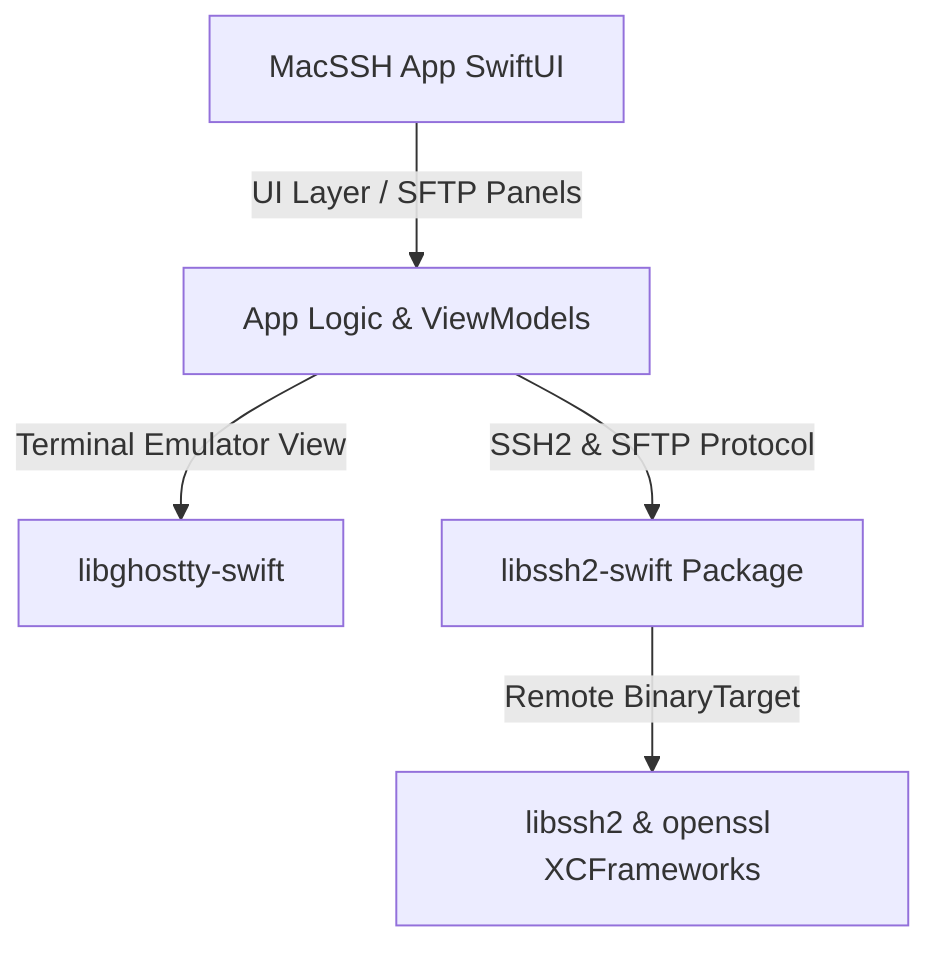

# MacSSH

[中文版](README_zh.md)

`MacSSH` is a modern, fast, and native **SSH & SFTP client** handcrafted for macOS.

Built entirely with SwiftUI, it features GPU-accelerated terminal rendering driven by the Ghostty emulator engine (`libghostty-swift`) and robust SSH2 session handling via an isolated SPM package (`libssh2-swift`).

---

## Modular Architecture

To ensure separation of concerns and maintain a repository size under 1MB, `MacSSH` decomposes its modules cleanly:



- **Host Application (`MacSSH`)**: Governs SSH settings editor, tabs management, Keychain data flow, side-panel dashboard, and localized SwiftUI assets.
- **Terminal System (`libghostty-swift`)**: Embeds high-performance virtual terminal state machines and Metal views.
- **Connection Core (`libssh2-swift`)**: Bridges raw TCP socket structures to Swift `actor` mechanisms, resolving low-level C libraries (`libssh2` and `openssl`) via remote binary targets.

---

## Core Features

- ⚡ **Metal-Accelerated VT**: Powered by Ghostty's core, offering lag-free interactive shell rendering.
- 📦 **Ultra Lightweight**: No bulky static binary `.a` files committed to Git. Resolved strictly on-demand during build phases.
- 🛡️ **Swift 6 Concurrency**: Conforms 100% to rigid concurrency rules, eliminating data-races during multiplexed SSH channel tasks.
- 📊 **Host System Monitor**: Displays host health metrics (CPU utilization, physical memory usage, disk storage, and average loads) right in the sidebar.
- 📁 **Built-in SFTP Panels**: Visual directory inspector enabling instant recursive uploads, downloads, and navigation.

---

## Getting Started

The Xcode project file (`MacSSH.xcodeproj`) is generated dynamically using [XcodeGen](https://github.com/yonaskolb/XcodeGen).

1. **Install XcodeGen**:
   ```bash
   brew install xcodegen
   ```

2. **Generate Xcode Project**:
   Run this command in the project directory root:
   ```bash
   xcodegen
   ```

3. **Build & Run**:
   - Launch `MacSSH.xcodeproj`.
   - On the first load, Xcode will fetch remote Swift packages (it might take a minute to download the XCFramework binaries).
   - Target the `MacSSH` scheme and press `Cmd + R` to run the application.
