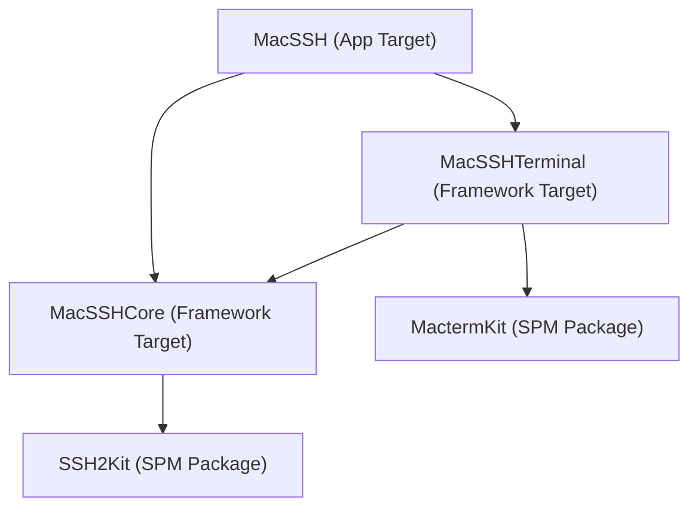

# MacSSH

[English](README.md) | [简体中文](README.zh-CN.md)

`MacSSH` is a modern, fast, and native **SSH & SFTP client** handcrafted for macOS.

Built entirely with SwiftUI, it features GPU-accelerated terminal rendering driven by the Ghostty emulator engine (`MactermKit`) and robust SSH2 session handling via an isolated SPM package (`SSH2Kit`).

---

## Modular Architecture

To ensure separation of concerns and maintain a zero-bloat repository, `MacSSH` cleanly decouples its architecture using Tuist targets:


```mermaid
graph TD
    App["MacSSH (App Target)"] --> Core["MacSSHCore (Framework Target)"]
    App --> Terminal["MacSSHTerminal (Framework Target)"]
    Terminal --> Core
    Terminal --> Ghostty["MactermKit (SPM Package)"]
    Core --> SSH["SSH2Kit (SPM Package)"]
```

- **`MacSSH` (App Shell)**: Governs SwiftUI views, windows, session navigation, Sparkle autoupdater, and app lifecycle.
- **`MacSSHCore` (Framework)**: Encapsulates data models (`SSHConnection`, `SessionTab`, `Snippet`), hosts status monitors, and SSH credential management.
- **`MacSSHTerminal` (Framework)**: Bridges the Ghostty virtual terminal emulator (`MactermKit` / `MactermKitCore.xcframework`) with Metal rendering views.

---

## Core Features

- ⚡ **Metal-Accelerated VT**: Powered by Ghostty's core, offering lag-free interactive shell rendering.
- 🪄 **Liquid Glass Design**: Clean 2-layer session tabs, unified Slate dark background (`#24272e`), and transparent titlebar integration.
- 💻 **Code Snippets Library**: Built-in shell snippets panel inside the right Inspector sidebar with single-click execution into active SSH & local shells.
- 📊 **Real-time Host System Monitor**: Full-width capsule progress indicators for CPU, memory, disk, and load averages.
- 📁 **Built-in SFTP Panels**: Visual directory inspector enabling instant recursive uploads, downloads, and navigation.
- 🛡️ **Swift 6 Concurrency**: Conforms 100% to rigid concurrency rules, eliminating data-races during multiplexed SSH channel tasks.

---

## 🛠️ Build from Source

### Prerequisites

1. **Xcode 16+** installed with macOS SDK.
2. **Tuist**: Ensure Tuist is installed (`mise install tuist` or `curl -fsSL https://get.tuist.io | bash`).

### Generating & Building Project

```bash
# 1. Clone repository
git clone https://github.com/SteveShi/MacSSH.git
cd MacSSH

# 2. Generate workspace via Tuist
tuist generate

# 3. Open and build in Xcode
xcodebuild build -workspace MacSSH.xcworkspace -scheme MacSSH -destination 'platform=macOS'
```

---

## License

`MacSSH` is released under the [MIT License](LICENSE).
