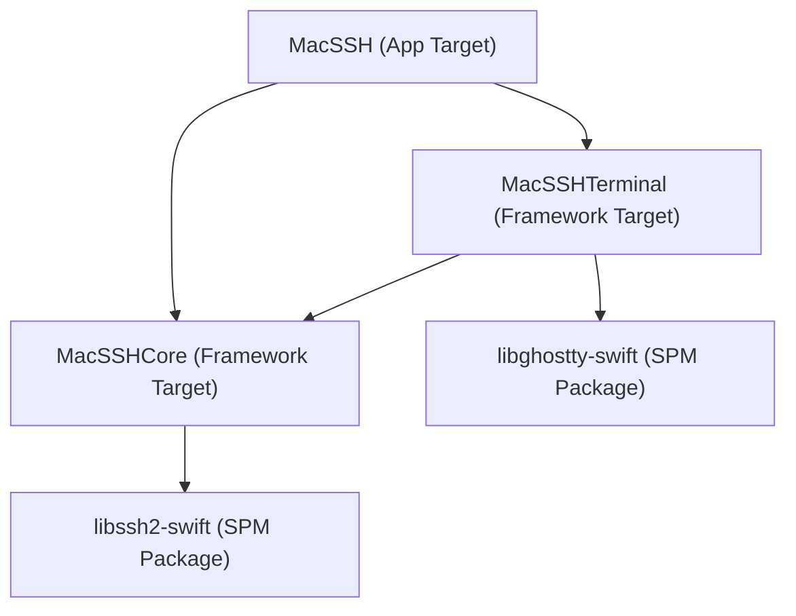

# MacSSH

[中文版](README_zh.md)

`MacSSH` is a modern, fast, and native **SSH & SFTP client** handcrafted for macOS.

Built entirely with SwiftUI, it features GPU-accelerated terminal rendering driven by the Ghostty emulator engine (`libghostty-swift`) and robust SSH2 session handling via an isolated SPM package (`libssh2-swift`).

---

## Modular Architecture

To ensure separation of concerns and maintain a zero-bloat repository, `MacSSH` cleanly decouples its architecture using Tuist targets:


```mermaid
graph TD
    App["MacSSH (App Target)"] --> Core["MacSSHCore (Framework Target)"]
    App --> Terminal["MacSSHTerminal (Framework Target)"]
    Terminal --> Core
    Terminal --> Ghostty["libghostty-swift (SPM Package)"]
    Core --> SSH["libssh2-swift (SPM Package)"]
```

- **`MacSSH` (App Shell)**: Governs SwiftUI views, windows, session navigation, Sparkle autoupdater, and app lifecycle.
- **`MacSSHCore` (Framework)**: Encapsulates data models (`SSHConnection`, `SessionTab`), hosts status monitors, and SSH credential management.
- **`MacSSHTerminal` (Framework)**: Bridges the Ghostty virtual terminal emulator (`libghostty-vt.dylib`) with Metal rendering views.

---

## Core Features

- ⚡ **Metal-Accelerated VT**: Powered by Ghostty's core, offering lag-free interactive shell rendering.
- 📦 **Ultra Lightweight**: No bulky static binary `.a` files committed to Git. Resolved strictly on-demand during build phases.
- 🛡️ **Swift 6 Concurrency**: Conforms 100% to rigid concurrency rules, eliminating data-races during multiplexed SSH channel tasks.
- 📊 **Host System Monitor**: Displays host health metrics (CPU utilization, physical memory usage, disk storage, and average loads) right in the sidebar.
- 📁 **Built-in SFTP Panels**: Visual directory inspector enabling instant recursive uploads, downloads, and navigation.

---

## 🛠️ Build from Source

### Requirements

- macOS 15.0 (Sequoia) or later
- Xcode 16.4 or later

### Steps

The Xcode project file (`MacSSH.xcodeproj`) is generated dynamically using [Tuist](https://tuist.io/).

1. **Install Tuist**:
   ```bash
   mise install tuist
   ```

2. **Clone and generate**:
   ```bash
   git clone https://github.com/SteveShi/MacSSH.git
   cd MacSSH
   tuist generate
   ```

3. Open `MacSSH.xcodeproj` in Xcode and build.

## 🔧 Tech Stack

| Layer | Technology |
|-------|-----------|
| Terminal Engine | [Ghostty VT](https://ghostty.org/) (`libghostty-vt`) |
| UI Framework | SwiftUI (macOS 15+) |
| SSH Transport | Built-in `ssh` command |
| Credential Store | macOS Keychain via [KeychainAccess](https://github.com/kishikawakatsumi/KeychainAccess) |
| Auto Update | [Sparkle](https://sparkle-project.org/) |
| Project Generation | [Tuist](https://tuist.io/) |
