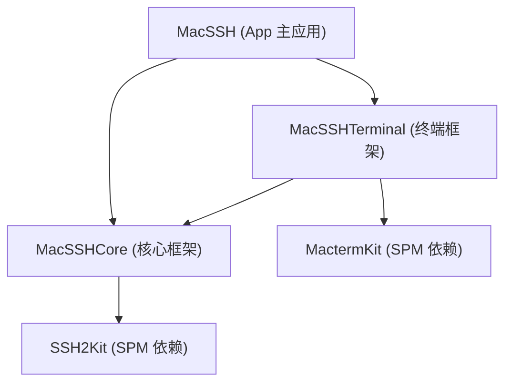

# MacSSH

[English](README.md) | [简体中文](README.zh-CN.md)

`MacSSH` 是一款专为 macOS 精心打造的原生现代 **SSH 与 SFTP 客户端**。

应用全量基于 SwiftUI 构建，借助 Ghostty 终端引擎（`MactermKit`）实现流畅的 Metal GPU 硬件加速渲染，并通过独立的 SPM 模块（`SSH2Kit`）保障高并发 SSH2 会话的稳定性与安全性。

---

## 模块化架构

为了保持单一职责并实现零代码膨胀，`MacSSH` 采用 Tuist 进行模块化解耦：



- **`MacSSH` (主应用外壳)**：负责 SwiftUI 视图生命周期、窗口管理、导航交互与 Sparkle 自动更新。
- **`MacSSHCore` (基础核心库)**：定义核心模型（`SSHConnection`、`SessionTab`、`Snippet`）、状态监控与安全凭证持久化。
- **`MacSSHTerminal` (终端框架)**：封装 Ghostty 虚拟终端引擎（`MactermKit` / `MactermKitCore.xcframework`）与 Metal 渲染管线。

---

## 核心特性

- ⚡ **Metal GPU 硬件加速**：基于 Ghostty 核心引擎，呈现丝滑无延迟的交互式终端体验。
- 🪄 **Liquid Glass 现代视觉**：纯净双层标签栏结构，全屏统一 Slate 灰青底色（`#24272e`），透明标题栏与终端无缝融合。
- 💻 **全功能代码片段库（Snippets）**：右侧检查器侧边栏内置代码片段管理，支持一键注入并执行到当前 SSH 或本地 Shell。
- 📊 **实时系统指标监控**：全宽胶囊进度条呈现 CPU、内存、磁盘与多核负载均衡。
- 📁 **内置可视 SFTP 面板**：支持一键展开多级目录，提供高速递归上传与下载。
- 🛡️ **Swift 6 严苛并发**：100% 遵循 Swift 6 并发模型，彻底消除多通道 SSH 任务的数据竞争风险。

---

## 🛠️ 源码构建

### 环境要求

1. **Xcode 16+**（已安装 macOS SDK）。
2. **Tuist**：确保已安装 Tuist (`mise install tuist` 或 `curl -fsSL https://get.tuist.io | bash`)。

### 生成与编译

```bash
# 1. 克隆代码仓库
git clone https://github.com/SteveShi/MacSSH.git
cd MacSSH

# 2. 通过 Tuist 生成 Xcode 工程
tuist generate

# 3. 编译验证
xcodebuild build -workspace MacSSH.xcworkspace -scheme MacSSH -destination 'platform=macOS'
```

---

## 开源协议

`MacSSH` 遵循 [MIT 开源协议](LICENSE)。
