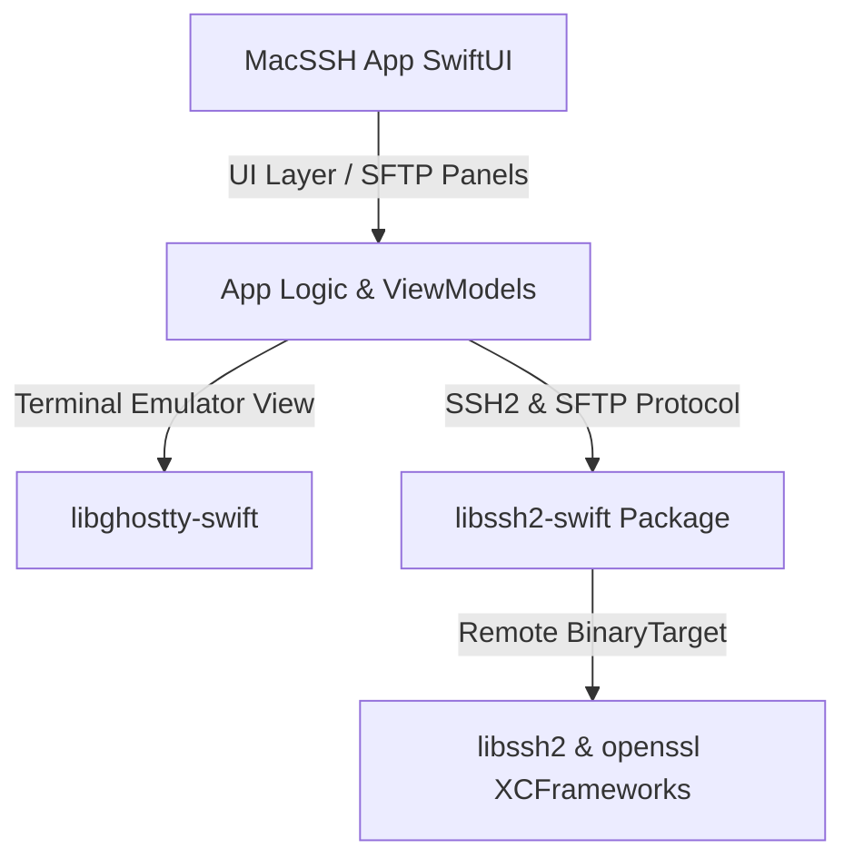

# MacSSH 中文说明文档

[English](README.md)

`MacSSH` 是一款为 macOS 精心打造的现代化、极速且安全的原生 **SSH & SFTP 客户端**。

它摒弃了传统 SSH 工具的臃肿与复杂，采用纯 SwiftUI 构建，底层的终端渲染由 Ghostty 引擎（`libghostty-swift`）驱动，网络层与 SSH2 协议解析则由远程二进制包（`libssh2-swift`）无缝保障。

---

## 核心架构设计

为了实现代码的高内聚、低耦合以及仓库的极度轻量化，`MacSSH` 采用了模块化架构：



1. **MacSSH (主壳)**：100% 纯 Swift 编写的宿主 App，负责多标签管理、主机配置存储、Keychain 密码保存、已知主机指纹提示（Known Hosts）、SFTP 交互面板以及系统监控。
2. **libghostty-swift (模块)**：独立的终端渲染引擎，将 Ghostty 强悍的 VT 解析和 Metal 硬件加速渲染能力引入 App。
3. **libssh2-swift (模块)**：高内聚的网络与加密层，它包装了 C 原生静态库（`libssh2`/`openssl`），通过 GitHub Release 附件在编译时按需加载二进制 XCFramework，实现 Git 仓库体积小于 1MB。

---

## 核心特性

- ⚡ **Metal 极速渲染**：基于 Ghostty 终端核心，享受媲美原生 GPU 加速的丝滑终端输出。
- 📦 **轻量极简**：项目移除了所有本地打包的 `.a` 静态库，通过 SPM 远程拉取依赖，CI 自动构建，零配置负担。
- 🛡️ **安全隔离**：完全满足 Swift 6 Concurrency 并发安全检查，使用 Keychain 加密管理连接密钥与密码。
- 📊 **系统监控边栏**：内置简易的远程系统监控看板，实时掌握主机 CPU、内存、磁盘以及负载指标。
- 📁 **双向 SFTP 文件传输**：集成侧边/底部 SFTP 交互文件面板，支持目录双击导航，极速上传和下载。

---

## 如何构建与运行

由于项目使用 [XcodeGen](https://github.com/yonaskolb/XcodeGen) 自动维护 Xcode 项目文件，您需要按如下步骤生成工程：

1. **安装 XcodeGen**：
   ```bash
   brew install xcodegen
   ```

2. **生成 Xcode 工程**：
   在仓库根目录下运行：
   ```bash
   xcodegen
   ```

3. **打开并编译**：
   - 打开自动生成的 `MacSSH.xcodeproj`。
   - 首次编译时，Xcode 会自动解析依赖（包括 `libghostty-swift` 和 `libssh2-swift` 及其对应的 C 依赖），这可能需要 1~2 分钟。
   - 选择 `MacSSH` scheme，按 `Command + R` 直接运行。
