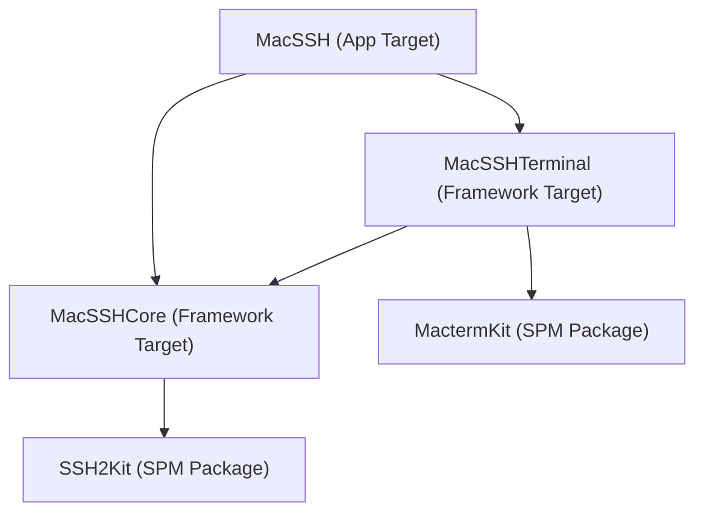

# MacSSH 中文说明文档

[English](README.md)

`MacSSH` 是一款为 macOS 精心打造的现代化、极速且安全的原生 **SSH & SFTP 客户端**。

它摒弃了传统 SSH 工具的臃肿与复杂，采用纯 SwiftUI 构建，底层的终端渲染由 Ghostty 引擎（`MactermKit`）驱动，网络层与 SSH2/SFTP 协议解析则由模块化组件（`SSH2Kit`）无缝保障。

---

## 核心架构设计

为了实现高内聚、低耦合以及工程层面的清晰解耦，`MacSSH` 通过 Tuist 划分了 3 个本地 Target 模块与 SPM 扩展：


```mermaid
graph TD
    App["MacSSH (App Target)"] --> Core["MacSSHCore (Framework Target)"]
    App --> Terminal["MacSSHTerminal (Framework Target)"]
    Terminal --> Core
    Terminal --> Ghostty["MactermKit (SPM Package)"]
    Core --> SSH["SSH2Kit (SPM Package)"]
```

1. **`MacSSH` (主壳 App)**：纯 SwiftUI 宿主视图与应用生命周期，负责窗口/Tab 标签页管理及 Sparkle 自动更新。
2. **`MacSSHCore` (核心业务模块)**：数据模型（`SSHConnection`、`SessionTab`）、Keychain 凭据加密与主机监控。
3. **`MacSSHTerminal` (终端渲染模块)**：桥接 Ghostty 终端引擎（`MactermKit` / `GhosttyKit.xcframework`）与 Metal 硬件加速渲染视图。

---

## 核心特性

- ⚡ **Metal 极速渲染**：基于 Ghostty 终端核心，享受媲美原生 GPU 加速的丝滑终端输出。
- 📦 **轻量极简**：项目移除了所有本地打包的 `.a` 静态库，通过 SPM 远程拉取依赖，CI 自动构建，零配置负担。
- 🛡️ **安全隔离**：完全满足 Swift 6 Concurrency 并发安全检查，使用 Keychain 加密管理连接密钥与密码。
- 📊 **系统监控边栏**：内置简易的远程系统监控看板，实时掌握主机 CPU、内存、磁盘以及负载指标。
- 📁 **双向 SFTP 文件传输**：集成侧边/底部 SFTP 交互文件面板，支持目录双击导航，极速上传和下载。

---

## 🛠️ 从源码构建

### 要求

- macOS 15.0（Sequoia）或更高版本
- Xcode 16.4 或更高版本

### 步骤

由于项目使用 [Tuist](https://tuist.io/) 声明式管理 Xcode 项目文件，您需要按如下步骤生成工程：

1. **安装 Tuist**：
   ```bash
   mise install tuist
   ```

2. **克隆并生成项目文件**：
   ```bash
   git clone https://github.com/SteveShi/MacSSH.git
   cd MacSSH
   tuist generate
   ```

3. 在 Xcode 中打开 `MacSSH.xcodeproj` 并构建。

## 🔧 技术栈

| 层级 | 技术 |
|------|-----|
| 终端引擎 | [Ghostty](https://ghostty.org/) (`MactermKit` / `GhosttyKit.xcframework`) |
| SSH & SFTP 引擎 | `SSH2Kit` (`libssh2` + `AWS-LC`) |
| 界面框架 | SwiftUI (macOS 15+) |
| SSH 传输 | 内置 `ssh` 命令 |
| 凭据存储 | macOS 钥匙串（通过 [KeychainAccess](https://github.com/kishikawakatsumi/KeychainAccess)） |
| 自动更新 | [Sparkle](https://sparkle-project.org/) |
| 项目生成 | [Tuist](https://tuist.io/) |
