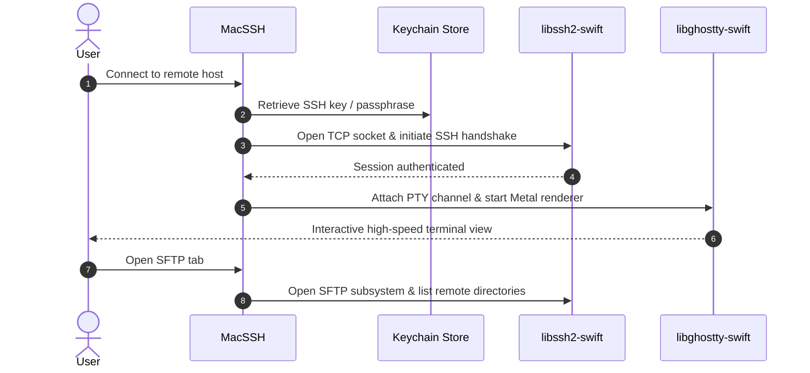

# Key flows

```mermaid
sequenceDiagram
    autonumber
    actor User
    participant App as MacSSH
    participant Key as Keychain Store
    participant SSH as libssh2-swift
    participant Ghostty as libghostty-swift

    User->>App: Connect to remote host
    App->>Key: Retrieve SSH key / passphrase
    App->>SSH: Open TCP socket & initiate SSH handshake
    SSH-->>App: Session authenticated
    App->>Ghostty: Attach PTY channel & start Metal renderer
    Ghostty-->>User: Interactive high-speed terminal view
    User->>App: Open SFTP tab
    App->>SSH: Open SFTP subsystem & list remote directories
```
