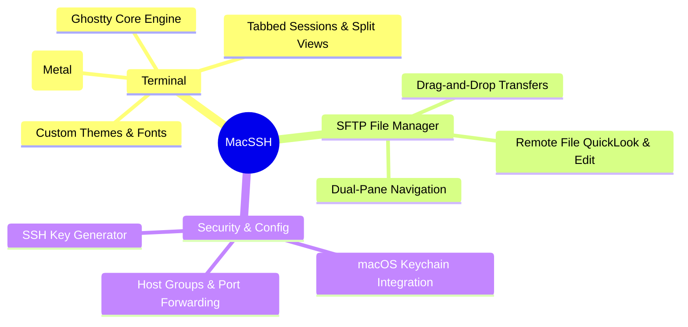

# Feature mindmap

```mermaid
mindmap
  root((MacSSH))
    Terminal
      GPU Acceleration (Metal)
      Ghostty Core Engine
      Tabbed Sessions & Split Views
      Custom Themes & Fonts
    SFTP File Manager
      Dual-Pane Navigation
      Drag-and-Drop Transfers
      Remote File QuickLook & Edit
    Security & Config
      macOS Keychain Integration
      SSH Key Generator
      Host Groups & Port Forwarding
```
